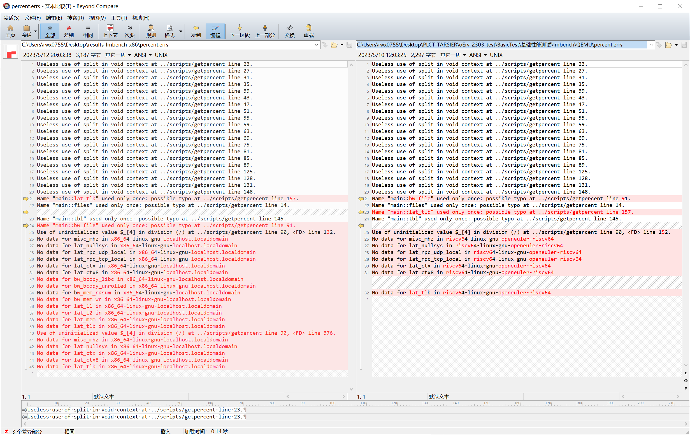
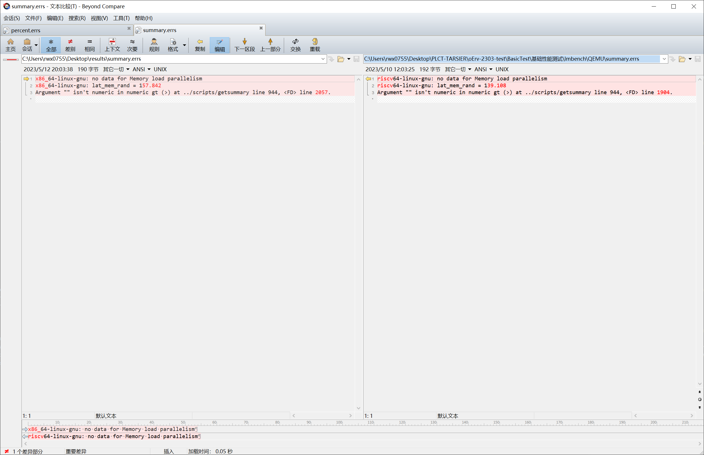

## 测试结果

测试通过，但运行部分项目时内核日志有报错，不影响测试结果。

测试结果详见对应目录下的日志文件。

与 openEuler 23.03 x86_64 执行 lmbench 时程序输出的错误日志进行了对比，注意到 RISC-V 平台出现的报错在 x86_64 均有出现，没有出现 RISC-V 平台特有的错误，对比结果见下图。x86_64 平台下的测试结果位于 [x86_64](./x86_64/) 目录中，供参考。

左：openEuler 23.03 x86_64，右：openEuler 23.03 RISC-V on QEMU

